## Overview

A Firefox OS project to bring smart data consumption to users in emerging
markets so that they can do more with less data.

This project aims to help keep users informed and in control of the data
consumed by their device and the applications on it.

## User Stories

### From Frog Mozilla Concepts

"In emerging markets, about 90% of mobile subscribers are using prepaid plans
for which they need to manage their credits and spending. Brazilian carriers
have various promotions and deals, and users monitor these to make choices on
what SIMs to use."

*Source: “Emerging Markets Opportunities” Mozilla Market Insights July 2011*

"As Mozilla’s research showed, emerging market users are juggling multiple
phones, SIMs, and plans to maximize coverage and to pay lower in-network rates
as they communicate with their friends and family. Managing this complexity is a
real user pain point, with users cobbling together their own solutions to cope."

"Today emerging market users employ many workarounds to overcome limited
internet access and to minimize paying for content, from sideloading content
purchased at local markets to sharing content through Bluetooth or cords."

*Source: Mozilla User Experience Research 2012*

#### Questions

- For each launch market, what is the distribution of people who have this
problem having to "juggle phones", "juggle SIMs", and normal phone usage?
- Is limited internet access still an issue in 2014?
  - Is there a trend we can look at to see how quickly it is becoming a non-issue?
- Are there any other "workarounds" people use to minimize for paying for content?
- What would be an acceptable price to pay for content?

### Existing User Scenarios

#### Sofia

*Gathered from [FFOS_OfflineConcepts3f_09_merged.pdf][offlineConcepts2014]*
[offlineConcepts2014]:https://mozilla.box.com/s/ak3iva799ppavdxgcl63

##### Persona

Sofia is a second year art student, trying to save money by living at home.
Money is tight, but she’s doing the most with what she has. She pays for her own
plan, but her brother gave her the phone. She likes this phone, it helps her
avoid all of the extra fees and it makes her feel good about how much she has
learned.

- I need to easily understand the current state
- I need an option to "set it and forget it" regarding my usage
- I work the system to save money

##### User Scenario

See [sofia.user.story.pdf](resources/sofia.user.story.pdf).

### Existing User Stories (Jan 2013)

*Gathered from [offline_concepts_jan2013.pdf][offlineConcepts2013]*
[offlineConcepts2013]:https://mozilla.box.com/s/ojjqc2tgsia6sdxqmvt9

Note: these do not solely focus on data consumption but also includes SMS and
Voice usage.

- As a cost conscious phone user, I want to know the amount of SMS/MMS messages
I’ve sent/received in a billing period, so that I can avoid extra charges.
  - Assumption: The networks our users use do not offer unlimited data plans
  - Assumption: If unlimited plans exist, our "cost consious" users cannot
  afford them.

- As a cost-conscious phone user, I want to know the amount of local and long
distance minutes I’ve used in a defined billing period, so that I can avoid
extra charges.
  - Assumptions: similar to previous.

- As a multiple-SIM user, I want to be able to separately track data associated
with each SIM card (including voice, messaging, and data), so that I can manage
services between SIMs.
  - Assumption: multiple SIM card users are a sizeable enough demographic to focus on

- As a cost-conscious phone user, I want to be able to track app network data
usage and individually restrict the usage of background data on mobile networks
for all apps on the device, so that I can avoid incurring unexpected data
charges. (Background data should still work over Wi-Fi.)
  - Assumption: users have a mental model of "background apps"
  - Assumption: apps use significant background data usage

- As a cost-conscious user, I want to update my apps on wifi so that I can save
data usage.

- As a cost-conscious user, I want to update my apps using a wired connection to
a computer so that I can save data usage while not requiring consistent wifi
access.
  - Assumption: a sizeable amount of users don't have a consistent wifi access

- As a cost-conscious user, I want to update my apps over bluetooth so that I
can share app updates with friends without using my data or having a wifi
connection.
  - Assumption: users want to share apps with friends
  - Assumption: users are so conscious of data concerns that they would not download an app over wifi
  - Assumption: users want apps
  - What if apps can be shared over WiFi direct?

#### Questions to validate assumptions

**Assumption:** The networks our users use do not offer unlimited data plans.

**Assumption:** If unlimited plans exist, our "cost consious" users cannot afford them.

- Are you a cost conscious user?
- Are there unlimited data/SMS/MMS plans?
  - Do you have a plan such as this?
  - As a cost conscious user, would you buy this type of plan?

**Assumption:** Multiple SIM card users are a sizeable enough demographic to focus on

Here we will need to look to market data.

- In each launch market, how what percentage of users use multiple SIM cards?
- Why do they use multiple SIM cards?

**Assumption:** users have a mental model of "background apps" and they use data

- What is a "background app"?
- When you switch apps, will your previous app be able to use data?

**Assumption:** apps use significant background data usage

Here we will have to look at some statistics of our platform and other platform
apps and how much data background apps use. Do we have any data on this?

**Assumption:** a sizeable amount of users don't have a consistent wifi access

- Where do you have a WiFi connection on a normal day?
- Over the course of a day, how much WiFi access do you have?

**Assumption:** users want to share apps with friends

- How do you find out about apps?
- Do you share apps with your friends?
  - Are there any challenges with sharing apps?
  - How often?

**Assumption:** users are so conscious of data concerns that they would not download an app over wifi

- Over what kind of a connection do you download apps?
- Are there any situations where you would not download an app over WiFi?

### Revised User Stories (2014) DRAFT

*This section is in draft form and will probably be revised and reorganized,
especially the priority groupings*

The following are user stories for the 2014 Smart Data Consumption refresh.

All of the these user stories need to be assessed from a customer segmentation
perspective to see if the number of people who fall into these user stories are
worth investing time into.

#### Firefox OS 2.1 Priority

These are determined by what bring us up to par with other solutions. These are
intended to be user stories which should be "most bang for the buck" (i.e. not a
lot of engineering time should need to be invested).

Higher listed items are to be considered higher priority.

##### Data Usage

* As a cost-conscious phone user, I want to be able to track individual app
network data usage so that I can be more informed how my data is being used.

* As a cost-conscious phone user, I want to be able to restrict specific apps
from using data *entirely*.

* As a cost-conscious phone user, I want to be able to restrict specific apps
from using data in the *background*.

* As a cost-conscious phone user, I want to restrict the usage of background
data on mobile networks when my battery level is low for all apps on the device.

##### Multiple SIM card support

The following are multiple SIM-card specific. The following questions need to be
answered before these can be fleshed out:

* How do people use multiple SIM cards (e.g. two slots or swapping)?
* Why do people use multiple SIM cards?
* If people swap SIM cards, can we make it a really painless experience to swap?
(i.e. no restarting, state is preserved)

Onto the user stories:

* As a multi-slot SIM user, I want to be able to specify which SIM should send
data requests through.

* As a multiple-SIM user who swaps SIMs, I want to easily update my usage plan
configuration on my phone to reflect the SIM in use.

* As a multiple-SIM user, I want to be able to separately track data usage
associated with each SIM card so that I can understand my usage between SIMs.

#### Down the road

These are user stories which will really differentiate ourselves from the
competition and really hit home hard on our value propositions.

* As a cost-conscious user, I want to update my apps on wifi so that I can save
data usage.

* As a cost conscious user, I want an easy way of informing my phone how many
minutes, texts and data are in my plan/billing cycle.
  * Possible high level solution:
  [Integration with operator usage plans](#integration-with-operator-usage-plans)

* As a cost conscious user, I want to be able to share my apps with friends out
of band to save data.

* As a cost-conscious user, I want to update my apps using a wired connection to
a computer so that I can save data usage while not requiring consistent wifi
access. **Too solution specific?**

* As a pre-paid user, I want to be able to buy more minutes, data and/or text
messages for my account.

##### Text, MMS, Voice usage

* As a cost conscious phone user, I want to know the amount of SMS/MMS messages
I’ve sent/received in a billing period, so that I can avoid extra charges.

* As a cost-conscious phone user, I want to know the amount of local and long
distance minutes I’ve used in a defined billing period, so that I can avoid
extra charges.

## Existing Solutions

### Opera Max

Opera Max is an android application to help monitor, record and save data on
a mobile device by using Opera's compression technologies. It works by sending
all mobile data (excluding WiFi) through their VPN. However, they make a point
not to interfere with secure connections. [1]

A big feature of theirs is to claim to be able to compress video streamed to a
device. They claim they can "make a 10 MB video become 3 MB". Other claims
include making "your data plan last up to 50% longer". [2]

- [Product page][2]
- [An intro video][operaMaxVideo]

#### Data Usage Timeline

Opera Max displays a chronological timeline of the data used by all your
applications. This can give users insight into when and how much data their
applications are using. In addition, savings are displayed at the top of the app
and in the usage bar of each app in green.

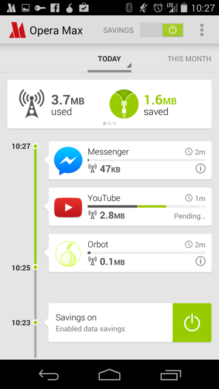

All application usage timeline, *Opera Max*

In addition, a user can see a detailed view of a specific application's data
usage over time as well. The user also has an ability to block the application
from using data.

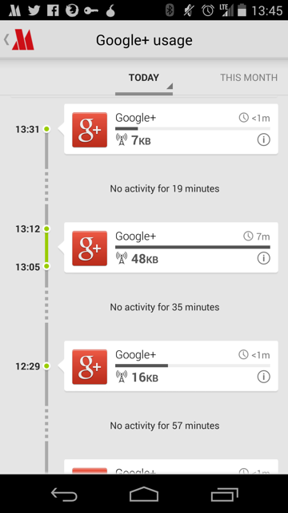

Application specific timeline, *Opera Max*

#### On-boarding

They have, in my opinion, a clear and understandable onboarding experience.
There are four screens that are shown:

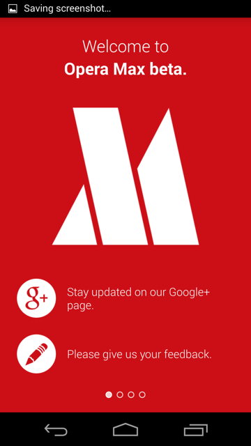

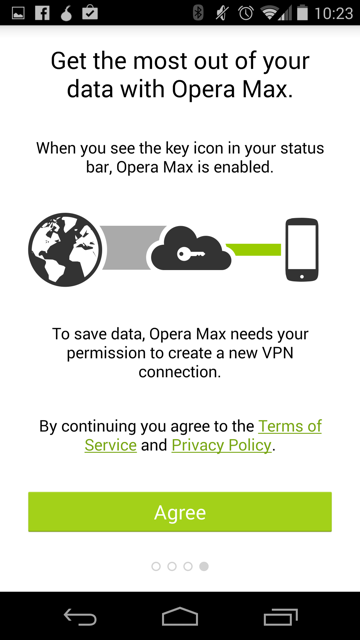

*Screenshots are from Opera Max's Android App*

[1]:http://www.opera.com/help/max/faq#sniffing
[2]:http://www.opera.com/mobile/max
[operaMaxVideo]:https://www.youtube.com/watch?v=U5UYfIAH_AM

### Opera Web Pass

[Product Page](http://www.operasoftware.com/products/web-pass)

Allows operators to package internet services to be based on time and or content
instead of per MB. This can make decisions for users easier because it relates
to terms they understand instead of MBs.

Users can buy packages to use the internet for a specified amount of time (e.g 3
minutes, an hour, a day, etc). They can also buy packages that enable a specific
application to work (e.g. Facebook, Twitter, etc). [1]

Opera believes Web Pass makes mobile data offerings "understandable and
affordable" to their users. [2]

This solution requires the Opera web browser.

> The system doesn’t require heavy integration efforts on the operator’s side,
as it supports third-party billing, header forwarding and Opera Mini zero
rating, so the operator can quickly deploy the solution for their customers
using low-end devices and feature phones. It also uses Opera’s data compression
technologies, to reduce data costs even further. [3]

#### Sponsored Web Pass

> Sponsored Web Pass enables operators to easily team up with advertisers to
sponsor the cost of customers' mobile internet access, providing users with free
mobile data. [1]

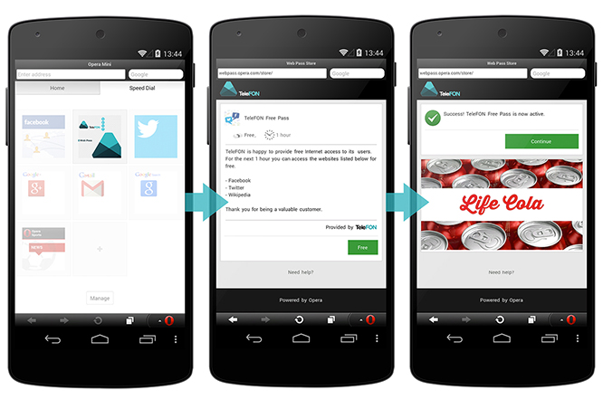
The process for a user to receive free internet through a sponsored web pass,
*Opera's Web Pass Product Page*

[1]:http://www.operasoftware.com/products/web-pass
[2]:http://www.operasoftware.com/blog/opera-products/introducing-sponsored-web-pass
[3]:http://techcrunch.com/2012/11/08/opera-web-pass-gives-mobile-subscribers-access-to-pay-as-you-go-internet-access-no-data-plan-required/

### Opera for Android

#### Off-road mode

Similar to [Opera Max](opera-max.md), the mobile version of opera supports a
mode called "off-road mode". From an external perspective, it appears to use
Opera's existing technologies developed for Max.

From Opera's FAQ:

> Off-Road mode uses the cloud-based compression technology from the Opera Mini
browser. This has some advantages and some drawbacks.

> * On slow and unreliable networks, Off-Road mode loads pages significantly
faster than the normal browsing mode.
* Data usage is significantly reduced and can be adjusted by changing the image quality setting.
* On slower devices, page rendering and scrolling can be faster.
* Some dynamic website features might not work flawlessly in Off-Road mode due
to its architecture.

##### Examples

*Off-road disabled (normal browsing) for [valentin.tsatsk.in][vt]*

*Off-road enabled for [valentin.tsatsk.in][vt]*

[vt]:http://valentin.tsatsk.in

##### Other

*Off-road savings display*

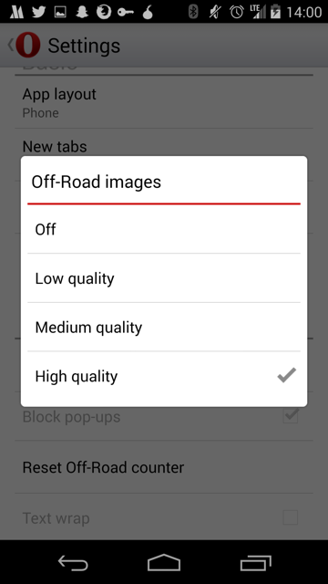

*Off-road image compression settings*

### Nokia Asha

#### Xpress Browser

[Product Page](http://www.nokia.com/global/apps/app/nokia-xpress/)

> Nokia Xpress Browser serves up your web pages as much as three times faster
than browsers on other phones – so you're online quicker than ever.

From my understanding, it seems to use techniques similar to what Opera and
others are making. Not much information could be found otherwise.

### BlackBerry DataSmart

DataSmart is a compression technology which proxies requests made by BlackBerry
devices through a server in order to save on data costs. It is similar to
Opera's compression technologies except for the lack of video compression.

> BlackBerry smartphones with DataSmart technology enable up to 2x more web
browsing, 4x more email and 2x more social networking than other leading
smartphones within your fixed data plan. According to Peter Rysavy, benefits of
BlackBerry smartphones with DataSmart technology could include lower monthly
service plans, faster application operation and increased battery life. [1], [2]

[1]:http://blogs.blackberry.com/2011/01/blackberry-datasmart/
[2]:http://rimblogs.files.wordpress.com/2011/01/2010_12_smartphone_efficiency.pdf

### Windows Phone

#### Data Sense

Can hook into operators to understand plan info so that manual configuration is
not required. Has an option to restrict background data usage when near limits
or always. [1]

Supports compression of pictures, blocking advertisements, and selective loading
of portions of websites to save data. [1]

A good rundown with pictures can be found in the Windows Phone Central article,
["All you need to know about Data Sense on Windows Phone 8.1"][wpArticle].

[1]:http://www.windowsphone.com/en-us/how-to/wp8/connectivity/use-data-sense-to-manage-data-usage
[wpArticle]:http://www.wpcentral.com/data-sense-windows-phone-81

#### WiFi Sense

> Wi-Fi Sense automatically connects you to nearby Wi-Fi networks, helping you
save your cellular data for when you really need it and giving you more Internet
connectivity options. Wi-Fi Sense can do a lot of things for you to get you
connected to the Internet using Wi-Fi, so you don't have to do them on your own.
[2]

There is also an [FAQ][faq] available. The aforementioned Windows Phone Central
article also describes WiFi sense.

[2]:http://www.windowsphone.com/en-us/how-to/wp8/connectivity/use-wi-fi-sense-to-get-connected
[faq]:http://www.windowsphone.com/en-us/how-to/wp8/connectivity/wi-fi-sense-faq

### Onavo

### Onavo Count for Android

[Google Play Store page](https://play.google.com/store/apps/details?id=com.onavo.android.onavoid)

A beautiful data monitor.

Makes use of interesting data metrics on application specific view:
* Hours used in current cycle
* Average minutes of usage per day
* Average MB of usage per minute
* Differentiating foreground and background

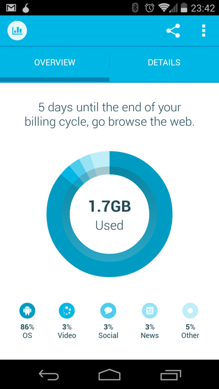

*Landing page overview*

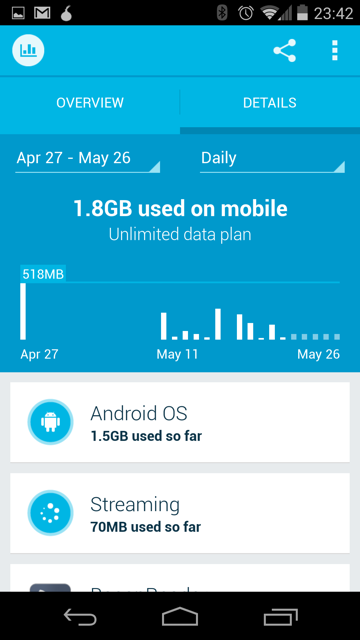

*Detail view (daily)*

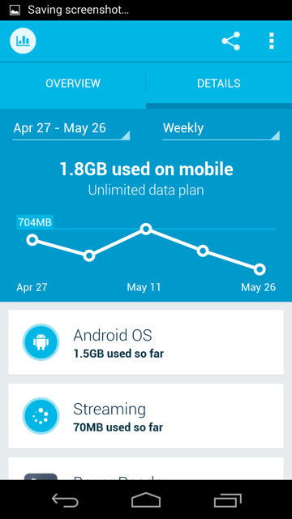

*Detail view (weekly)*

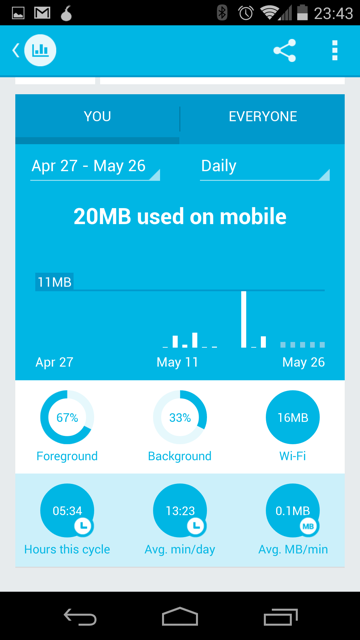

*Application specific details (Facebook Messenger)*

### Onavo Extend

[Google Play Store page](https://play.google.com/store/apps/details?id=com.onavo.android.onavoics)

Saves data by routing traffic to Onavo servers and using compression technology.
Caches images locally to prevent loading the same image twice. [1] This app is
very similar to Opera Max in it's value proposition. However, unlike Opera Max,
Onavo Extend does not attempt to report usage, only savings.

Has an interesting way of quantifying data saved by relating it to how many more
emails and videos the user can send on the current cycle.

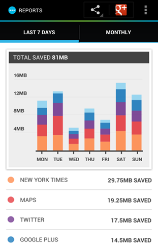

*Savings display with breakdown per app*

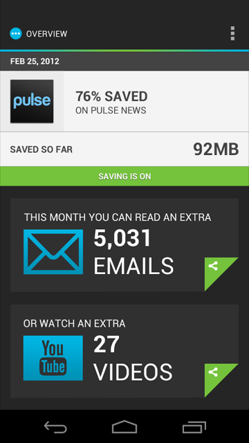

*Quantifying data saved with number of extra emails and videos user can consume*

[1]:http://www.onavo.com/apps/android_extend

## Concepts

### Understandable mental model of data

Apple made communicating to users how many songs their iPods could hold not by
talking about their devices in terms of the bytes they could hold, instead
they talked about the number of songs they could hold.

Referring to data consumption in terms of pages, apps, and other usage metrics
is probably more understandable than bytes. Even if it's just an estimate, it's
probably more useful, especially for people who have never had to deal with
computer metrics before.

The following metrics could be based on the user's historical average size of
content for that type:

* Pages loaded
* Tweets
* Minutes of video
  * Could be based off of current bitrate of active video as well.
* Site specific pages (e.g. Wikipedia article, Facebook profile)
* Minutes of songs
* Number of songs

### Positive reinforcement for saving data

Users could be rewarded for staying within their daily or monthly goals for data
usage. It is hypothesized that positive reinforcement of staying under the limit
may form habits for users to stay under those limits. Network operators'
opinions of this type of a feature will need to be considered.

### Forecasting predicted data usage

Analyze the user's historical usage trends for the cycle and attempt to build a
prediction model of how much data the user will use in the month. We can display
the predicted data usage for the month to the user. In addition, a warning can
be given to warn the user that they are consuming too quickly.

#### Open questions

* What features can we look at in order to gauge consumption patterns?

This idea was found in [My Data Manager][mdm].
[mdm]:https://play.google.com/store/apps/details?id=com.mobidia.android.mdm

### Analyzing Data Usage

If we are tracking traffic usage of each app, we should have a wealth of
historical information available. With this data, Firefox OS could try to give
smart advice for helping users use their data more efficiently.

Some ideas:

* Warn users if their current rate of usage will cause them to consume more
data than they have for their cycle.
* "You could save 200 MB a month if you disabled background data for *data hog*"
* "It looks like you're not using *background data hog* much yet it uses a
lot of data in the background. Would you like to disable background data for
this application?"

### Integration with operator usage plans

Carriers know how many minutes, texts, and data the user has left. This
information could be sycned with Firefox OS so that the user does NOT need to
configure their phone. It should "just work".

Anecdotes have been shared where this is not as easy as one might expect. What
are the complications with doing a carrier integration? Why can't this thing
be standardized once and for all and all mobile OSs understand how much usage
is available (instead of another proprietary solution)?

## Related Resources

**Box access is required*

**[Settings Drawer Spec](https://mozilla.app.box.com/files/0/f/1784123672)***

*The Firefox OS 2.0 Settings Drawer Spec. Will be useful to follow this design
language when mockups are made for this project.*
