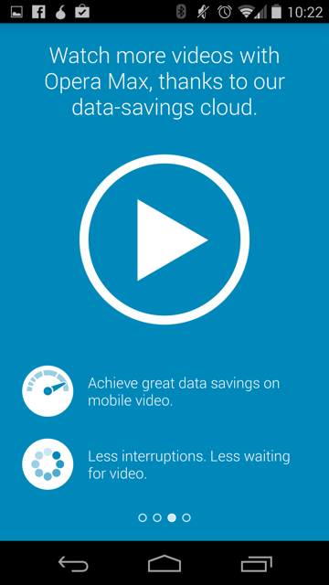
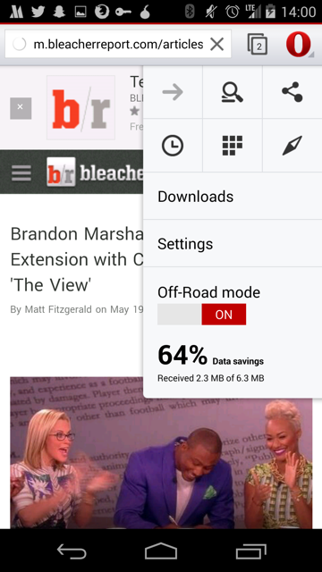

## Overview

A Firefox OS project to bring smart data consumption to users in emerging
markets so that they can do more with less data.

This project aims to help keep users informed and in control of the data
consumed by their device and the applications on it.

## User Stories

### From Frog Mozilla Concepts

"In emerging markets, about 90% of mobile subscribers are using prepaid plans
for which they need to manage their credits and spending. Brazilian carriers
have various promotions and deals, and users monitor these to make choices on
what SIMs to use."

*Source: “Emerging Markets Opportunities” Mozilla Market Insights July 2011*

"As Mozilla’s research showed, emerging market users are juggling multiple
phones, SIMs, and plans to maximize coverage and to pay lower in-network rates
as they communicate with their friends and family. Managing this complexity is a
real user pain point, with users cobbling together their own solutions to cope."

"Today emerging market users employ many workarounds to overcome limited
internet access and to minimize paying for content, from sideloading content
purchased at local markets to sharing content through Bluetooth or cords."

*Source: Mozilla User Experience Research 2012*

#### Questions

- For each launch market, what is the distribution of people who have this
problem having to "juggle phones", "juggle SIMs", and normal phone usage?
- Is limited internet access still an issue in 2014?
  - Is there a trend we can look at to see how quickly it is becoming a non-issue?
- Are there any other "workarounds" people use to minimize for paying for content?
- What would be an acceptable price to pay for content?

### Existing User Scenarios

#### Sofia

Source: FFOS_OfflineConcepts3f_09_merged.pdf

##### Persona

Sofia is a second year art student, trying to save money by living at home.
Money is tight, but she’s doing the most with what she has. She pays for her own
plan, but her brother gave her the phone. She likes this phone, it helps her
avoid all of the extra fees and it makes her feel good about how much she has
learned.

- I need to easily understand the current state
- I need an option to "set it and forget it" regarding my usage
- I work the system to save money

##### User Scenario

See [sofia.user.story.pdf](resources/sofia.user.story.pdf).

### Existing User Stories

#### From Offline Concepts (Jan 2013)

Note: these do no solely focus on data consumption but also includes SMS+Voice

- As a cost conscious phone user, I want to know the amount of SMS/MMS messages
I’ve sent/received in a billing period, so that I can avoid extra charges.
  - Assumption: The networks our users use do not offer unlimited data plans
  - Assumption: If unlimited plans exist, our "cost consious" users cannot
  afford them.

- As a cost-conscious phone user, I want to know the amount of local and long
distance minutes I’ve used in a defined billing period, so that I can avoid
extra charges.
  - Assumptions: similar to previous.

- As a multiple-SIM user, I want to be able to separately track data associated
with each SIM card (including voice, messaging, and data), so that I can manage
services between SIMs.
  - Assumption: multiple SIM card users are a sizeable enough demographic to focus on

- As a cost-conscious phone user, I want to be able to track app network data
usage and individually restrict the usage of background data on mobile networks
for all apps on the device, so that I can avoid incurring unexpected data
charges. (Background data should still work over Wi-Fi.)
  - Assumption: users have a mental model of "background apps"
  - Assumption: apps use significant background data usage

- As a cost-conscious user, I want to update my apps on wifi so that I can save
data usage.

- As a cost-conscious user, I want to update my apps using a wired connection to
a computer so that I can save data usage while not requiring consistent wifi
access.
  - Assumption: a sizeable amount of users don't have a consistent wifi access

- As a cost-conscious user, I want to update my apps over bluetooth so that I
can share app updates with friends without using my data or having a wifi
connection.
  - Assumption: users want to share apps with friends
  - Assumption: users are so conscious of data concerns that they would not download an app over wifi
  - Assumption: users want apps
  - What if apps can be shared over WiFi direct?

##### Questions to validate assumptions

**Assumption:** The networks our users use do not offer unlimited data plans.

**Assumption:** If unlimited plans exist, our "cost consious" users cannot afford them.

- Are you a cost conscious user?
- Are there unlimited data/SMS/MMS plans?
  - Do you have a plan such as this?
  - As a cost conscious user, would you buy this type of plan?

**Assumption:** Multiple SIM card users are a sizeable enough demographic to focus on

Here we will need to look to market data.

- In each launch market, how what percentage of users use multiple SIM cards?
- Why do they use multiple SIM cards?

**Assumption:** users have a mental model of "background apps" and they use data

- What is a "background app"?
- When you switch apps, will your previous app be able to use data?

**Assumption:** apps use significant background data usage

Here we will have to look at some statistics of our platform and other platform
apps and how much data background apps use. Do we have any data on this?

**Assumption:** a sizeable amount of users don't have a consistent wifi access

- Where do you have a WiFi connection on a normal day?
- Over the course of a day, how much WiFi access do you have?

**Assumption:** users want to share apps with friends

- How do you find out about apps?
- Do you share apps with your friends?
  - Are there any challenges with sharing apps?
  - How often?

**Assumption:** users are so conscious of data concerns that they would not download an app over wifi

- Over what kind of a connection do you download apps?
- Are there any situations where you would not download an app over WiFi?

## Existing Solutions

### Opera Max

Opera Max is an android application to help monitor, record and save data on
a mobile device by using Opera's compression technologies. It works by sending
all mobile data (excluding WiFi) through their VPN. However, they make a point
not to interfere with secure connections. [1]

A big feature of theirs is to claim to be able to compress video streamed to a
device. They claim they can "make a 10 MB video become 3 MB". Other claims
include making "your data plan last up to 50% longer". [2]

- [Product page][2]
- [An intro video][operaMaxVideo]

#### Data Usage Timeline

Opera Max displays a chronological timeline of the data used by all your
applications. This can give users insight into when and how much data their
applications are using. In addition, savings are displayed at the top of the app
and in the usage bar of each app in green.

All application usage timeline, *Opera Max*

In addition, a user can see a detailed view of a specific application's data
usage over time as well. The user also has an ability to block the application
from using data.

Application specific timeline, *Opera Max*

#### On-boarding

They have, in my opinion, a clear and understandable onboarding experience.
There are four screens that are shown:

*Screenshots are from Opera Max's Android App*

[1]:http://www.opera.com/help/max/faq#sniffing
[2]:http://www.opera.com/mobile/max
[operaMaxVideo]:https://www.youtube.com/watch?v=U5UYfIAH_AM

### Opera for Android

#### Off-road mode

Similar to [Opera Max](opera-max.md), the mobile version of opera supports a
mode called "off-road mode". From an external perspective, it appears to use
Opera's existing technologies developed for Max.

From Opera's FAQ:

> Off-Road mode uses the cloud-based compression technology from the Opera Mini
browser. This has some advantages and some drawbacks.

> * On slow and unreliable networks, Off-Road mode loads pages significantly
faster than the normal browsing mode.
* Data usage is significantly reduced and can be adjusted by changing the image quality setting.
* On slower devices, page rendering and scrolling can be faster.
* Some dynamic website features might not work flawlessly in Off-Road mode due
to its architecture.

##### Examples

*Off-road disabled (normal browsing) for [valentin.tsatsk.in][vt]*

*Off-road enabled for [valentin.tsatsk.in][vt]*

[vt]:http://valentin.tsatsk.in

##### Other

*Off-road savings display*

*Off-road image compression settings*

## Concepts

These are concept ideas for smart data sharing

### Having a more understandable mental model of data

Apple made communicating to users how many songs their iPods could hold not by
talking about their devices in terms of the bytes they could hold, instead
they talked about the number of songs they could hold.

Referring to data consumption in terms of pages, apps, and other usage metrics
is probably more understandable than bytes. Even if it's just an estimate, it's
probably more useful, especially for people who have never had to deal with
computer metrics before.
