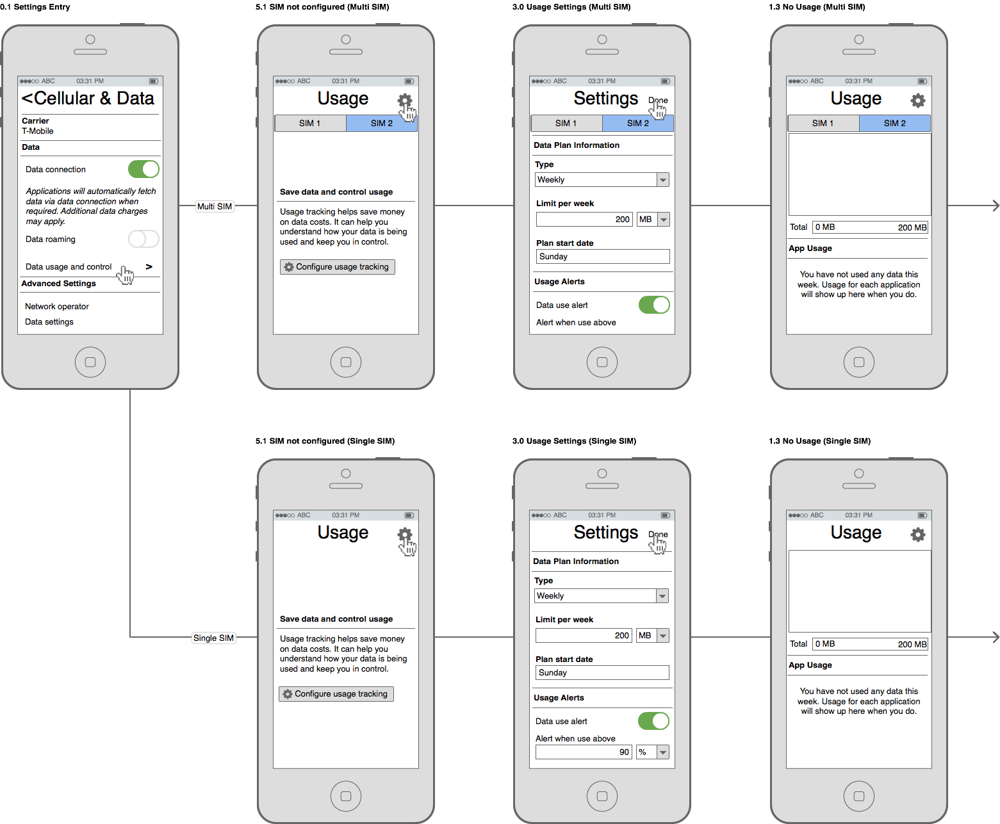
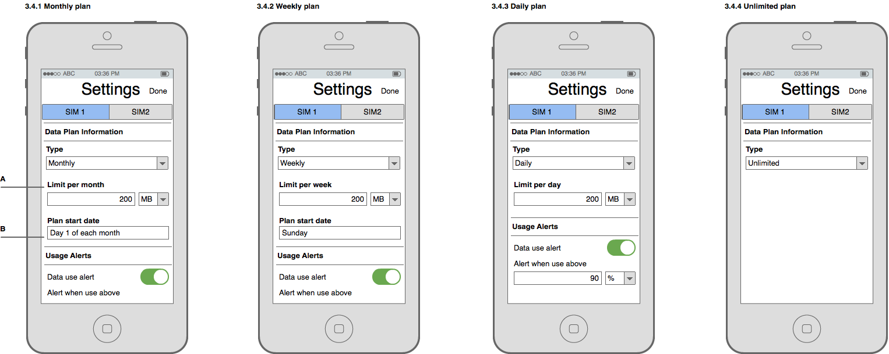
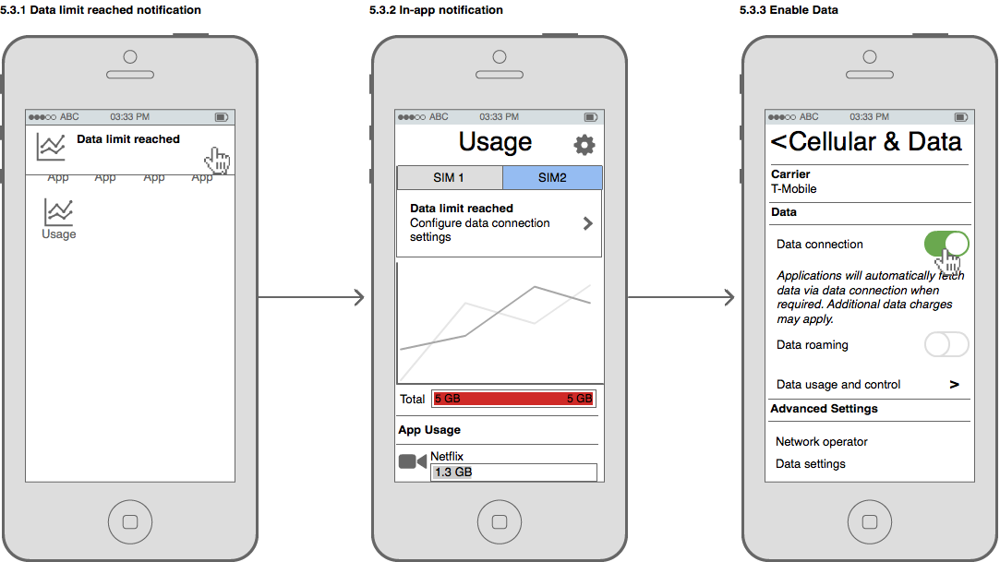

## Background

From our user value propositions, users need to understand and track their data
usage, so they don’t go over budget. Users should be enabled to do more with
less. [1]

[1]:https://mozilla.app.box.com/files/0/f/1958416320/1/f_17084860470

## User Stories

From the user research, we've identified user stories which will help guide us
to materialize these value propositions.

* As a cost-conscious phone user, I want to be able to track individual app
network data usage so that I can be more informed how my data is being used.

* As a cost-conscious phone user, I want to be able to restrict specific apps
from using data *entirely*.

* As a cost-conscious phone user, I want to be able to restrict specific apps
from using data in the *background*.

* As a cost-conscious phone user, I want to restrict the usage of background
data on mobile networks when my battery level is low for all apps on the device.

* As a multiple-SIM user who swaps SIMs, I want to easily update my usage plan
configuration on my phone to reflect the SIM in use.

* As a multiple-SIM user, I want to be able to separately track data usage
associated with each SIM card so that I can understand my usage between SIMs.

* As a user, when I go to use an app when I am out of data I want to be informed
that I am out of data and be given the opportunity to purchase more so that I
don't get a generic error message.

* As a user, I want to be able to explicitly put my device into a mode whereby
no mobile data can be used to allow me to control when I do not want data to be
consumed.

* As a user, I want to be able to override the data saving mode for a specific
app, temporarily, so that I can use that app without all of my other apps also
using data.

## Firefox OS 2.1

### First Time Experience

In each of these scenarios, the user has never opened the usage app and has
never configured their data plans. There is a large flow skipped, which is the
actual configuration of a user's plan in *Figure 3.0* of each scenario. See the
*SIM Plan Configuration* section for more details.

#### Notification Tray Discovery

In this scenario, the user discovers the usage app through the notification
tray.

In a multi-SIM device, if the user does not open the other SIM configuration, it
should be in an unconfigured state. A SIM in an unconfigured state will show a
screen such as *Figure 5.1* in the following section.

#### Home Screen Discovery

In this scenario the user discovers the usage app through the home screen.

As with the previous section, a SIM card that did not have its configuration
opened should be left in an unconfigured state.

#### Settings App Discovery

In this scenario, the user has come across the usage app through the navigating
through the system settings (*Settings > Cellular & Data > SIM 2*).

In a mulit-SIM configuration, the selected SIM should correspond to the SIM
active in the "Cellular and Data" settings view.

### Usage Overview

In a multi-SIM configuration, the SIM chosen for data connectivity in the SIM
Manager should be active view which is shown in *Figure 1.0*. The ordering of
the SIMs in the tab bar should not change.

The bar graphs for each application's usage should be proportional to the limit
displayed. In the case that an app's usage is too small to be shown accurately
as a bar graph, a small sliver should be shown as in the Map application in
*Figure 1.2*.

Usage bars which go above the limit should display a full bar graph along with
a visual style which indicates this. As an example, *Figure 1.2* shows the bars
displayed in red. The visual style should be sensitive to cultural meanings of
colours.

### Application Data Control

The application data control view should show data and controls in the context
of the device and not tied to a particular SIM. Therefore in a multi-SIM
configuration, the data usage should reflect both SIMs combined. Data control
toggles should be global toggles, thus toggling active SIMs should retain the
the same data control settings per app.

Pressing the back button in the top left should go back to the previous screen,
ensuring of the previous screen is preserved.

The cycle's usage, seen in *A*, should substitute "month" with the user's chosen
cycle. For example, if they are on a weekly cycle it would say "X MB of data
used this week".

### SIM Plan Configuration

When a user has changed their data plan with their service provider, they will
want their usage app configuration to reflect these changes. In the following
story, the user has upgraded from a weekly 200 MB plan to a 1GB monthly plan.

The limit amount label, *A*, should update to reflect the type of plan
specified. "Limit per month", "Limit per week", and "Limit per day" should be
used for monthly, weekly and daily plan types respectively.

The plan start date, *B*, should update based on the plan type as well. The day
of the week should be shown for weekly plans. "Day X of each month" should be
shown for monthly plans. The input field should not be shown at for daily plans.

If the unlimited plan type is selected, no other configuration should be shown.
No notifications should ever be shown. The usage notification tray should not
be shown either.

These behaviours are reflected in the following figures.

The device should remember SIM cards inserted and their respective plan
configurations.

### Notification tray bar

The usage bar in *Figure 4.1* should show the usage of the SIM selected for data
use. In an unlimited plan configuration or when no SIM card is inserted, no tray
bar should be shown.

### Data usage alerts

In the following scenario, the user has reached the threshold they've defined
for data use alerts.

The notification text, *A*, should be adjusted for the unit of data limit
reached. When a MB or GB limit is reached, the text should read "200 *X* of data
used".

In the following scenario, the user has reached their defined data limit.

### Chart

### Data savings tips

### Disabled app behaviour

The disabled app popover should only be shown when the user launches the app. It
should not be shown when doing ordinary task switching. If the system kills the
app due to low memory and the user task switches, the app popover should not be
shown.

### Unused secondary SIM slot

In multi-SIM devices with only one SIM card inserted, the device should follow
the single SIM versions of the specifications.

### Interactive Prototype

<iframe class="prototype prototype-fxos" src="prototypes/index.html"></iframe>

<iframe class="prototype prototype-fxos" src="prototypes/index-multi.html#SIM1"></iframe>

### Motion

#### SIM Toggle Animation

<video src="video/sim-toggle.webm" autoplay loop width="370"></video>

#### Settings Animation

<video src="video/settings.webm" autoplay loop width="340"></video>
