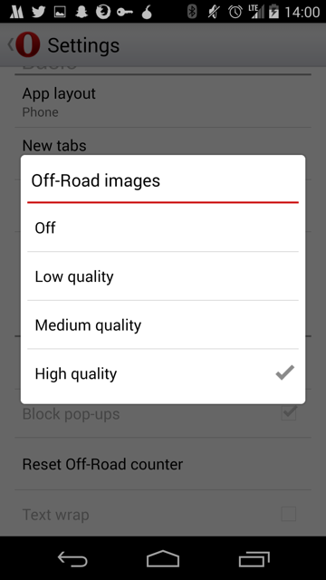

# Opera for Android

## Off-road mode

Similar to [Opera Max](opera-max.md), the mobile version of opera supports a
mode called "off-road mode". From an external perspective, it appears to use
Opera's existing technologies developed for Max.

From Opera's FAQ:

> Off-Road mode uses the cloud-based compression technology from the Opera Mini
browser. This has some advantages and some drawbacks.

> * On slow and unreliable networks, Off-Road mode loads pages significantly
faster than the normal browsing mode.
* Data usage is significantly reduced and can be adjusted by changing the image quality setting.
* On slower devices, page rendering and scrolling can be faster.
* Some dynamic website features might not work flawlessly in Off-Road mode due
to its architecture.

### Examples

*Off-road disabled (normal browsing) for [valentin.tsatsk.in][vt]*

*Off-road enabled for [valentin.tsatsk.in][vt]*

[vt]:http://valentin.tsatsk.in

### Other

*Off-road savings display*

*Off-road image compression settings*
