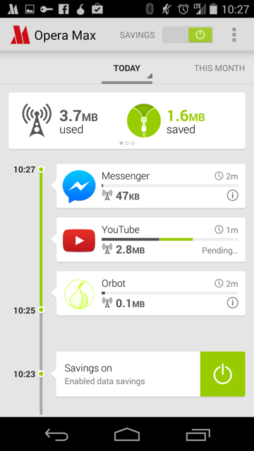
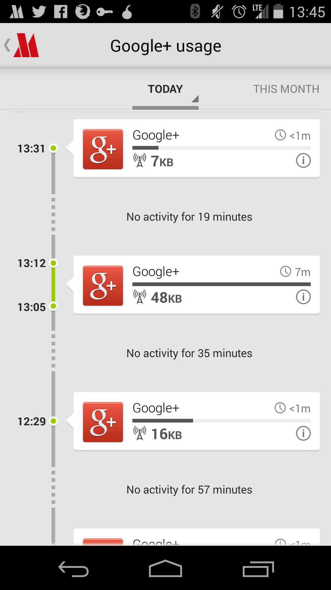
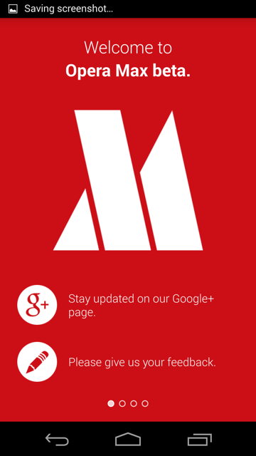
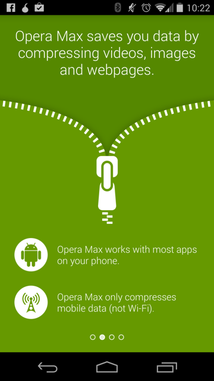
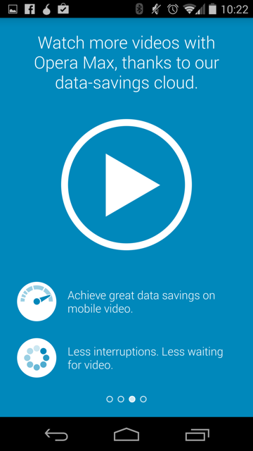
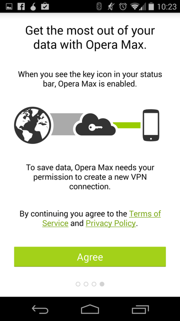

# Opera Max

Opera Max is an android application to help monitor, record and save data on
a mobile device by using Opera's compression technologies. It works by sending
all mobile data (excluding WiFi) through their VPN. However, they make a point
not to interfere with secure connections. [1]

A big feature of theirs is to claim to be able to compress video streamed to a
device. They claim they can "make a 10 MB video become 3 MB". Other claims
include making "your data plan last up to 50% longer". [2]

- [Product page][2]
- [An intro video][operaMaxVideo]

## Data Usage Timeline

Opera Max displays a chronological timeline of the data used by all your
applications. This can give users insight into when and how much data their
applications are using. In addition, savings are displayed at the top of the app
and in the usage bar of each app in green.

All application usage timeline, *Opera Max*

In addition, a user can see a detailed view of a specific application's data
usage over time as well. The user also has an ability to block the application
from using data.

Application specific timeline, *Opera Max*

## On-boarding

They have, in my opinion, a clear and understandable onboarding experience.
There are four screens that are shown:

*Screenshots are from Opera Max's Android App*

[1]:http://www.opera.com/help/max/faq#sniffing
[2]:http://www.opera.com/mobile/max
[operaMaxVideo]:https://www.youtube.com/watch?v=U5UYfIAH_AM
